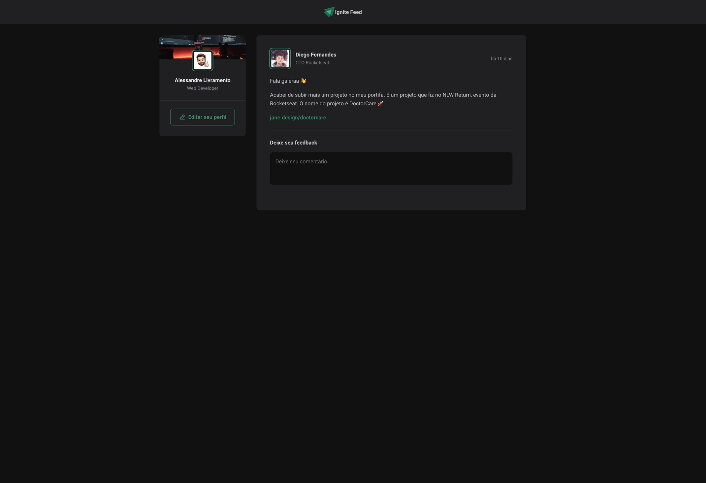

<div align="center" style="padding-bottom:30px; background:transparent">

</div>

## 💻 Projeto

Ignite Feed é um projeto da trilha de fundamentos de React JS da Rocketseat.

## 🚀 Tecnologias utilizadas

- [Vite JS](https://vitejs.dev)
- [Typescript](https://www.typescriptlang.org)
- [Phosphor Icons](https://phosphoricons.com)

### Instalação

```
Clone o repositório do Projeto

```

https://github.com/alessandre74/ignite-feed.git

```

Acesse o diretório do projeto

```

cd ignite-feed

```

Instale as dependências

```

yarn ou sudo yarn (com yarn )

npm install ou sudo npm install (com npm)

```

Start o aplicativo

```

npm run dev

```

## 📄 License

Este projeto está sob a licença MIT
```
